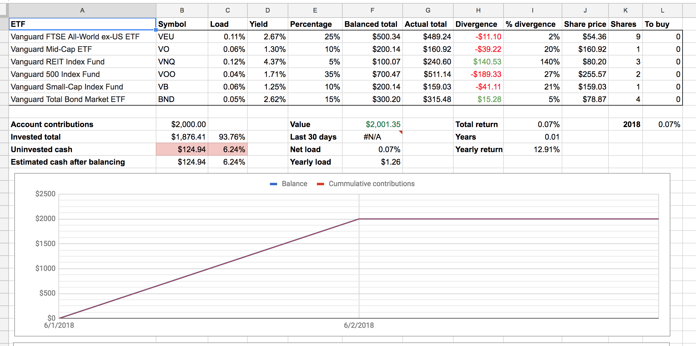
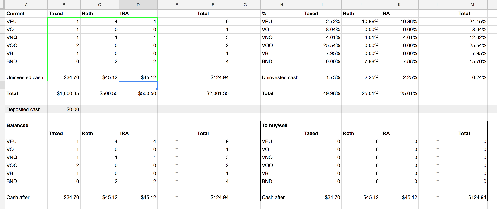

[](https://travis-ci.org/gnmerritt/etf-balancer)

# etf-balancer

Try and optimally balance an account of Vanguard ETFs given a target allocation. Runs as an API for easy use from google sheets.

## features

Balances funds to a target percentage across multiple accounts.

   * high-yield funds prioritized to tax-sheltered accounts
   * can avoid sales in taxable accounts
   * minimizes uninvested cash in each account
   * spreadsheet auto-updates to graph returns and balances over time

## CLI usage:

Describe your target allocation, your accounts and provide current market quotes
for the funds you're interested in balancing, something like this (via the
excellent [httpie](https://httpie.org/)):

```bash
http POST https://etf.gnmerritt.net/balance target:='{"VEU":0.7,"VOO":0.3}' accounts:='[{"name":"taxed", "tax_sheltered":false,"cash":1000, "positions":{"VEU":2, "VOO":2}}]' market:='[{"symbol":"VEU", "price":54.33},{"symbol":"VOO", "price":254.77}]' no_sale_accounts:='["taxed"]'
```

## spreadsheet usage:

I talk to the API via a google sheet which contains my account info, you can find a template here: [Google Sheet Template](https://docs.google.com/spreadsheets/d/1o8sxqQx-XOBXjGqna-EQ-8smx7PInTiPLUEc6tUZhr4/edit?usp=sharing). If you make yourself a copy you can start using it to balance your own accounts.




